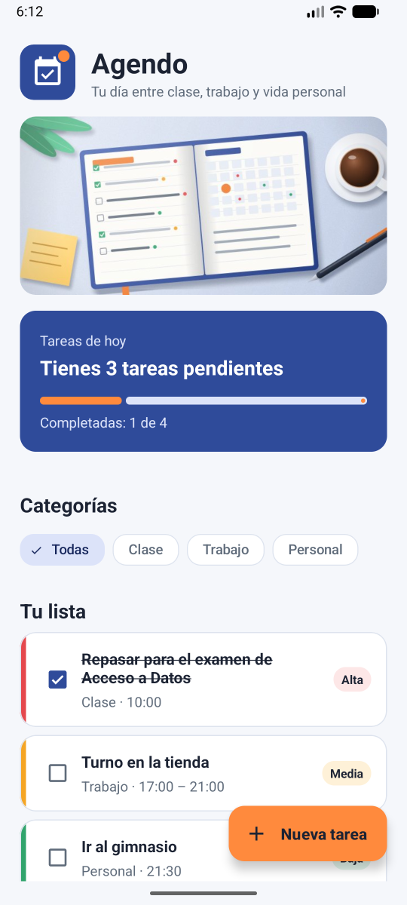
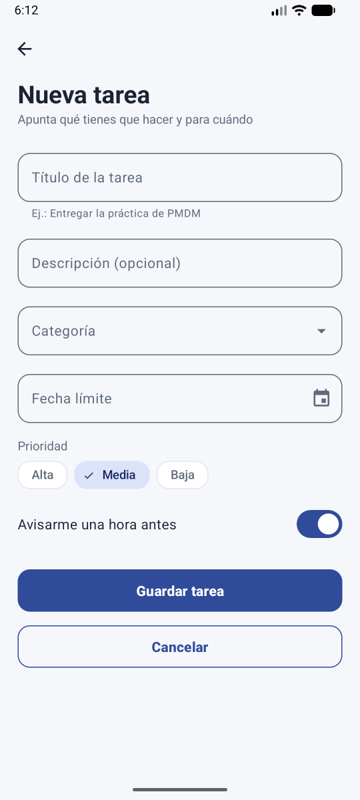
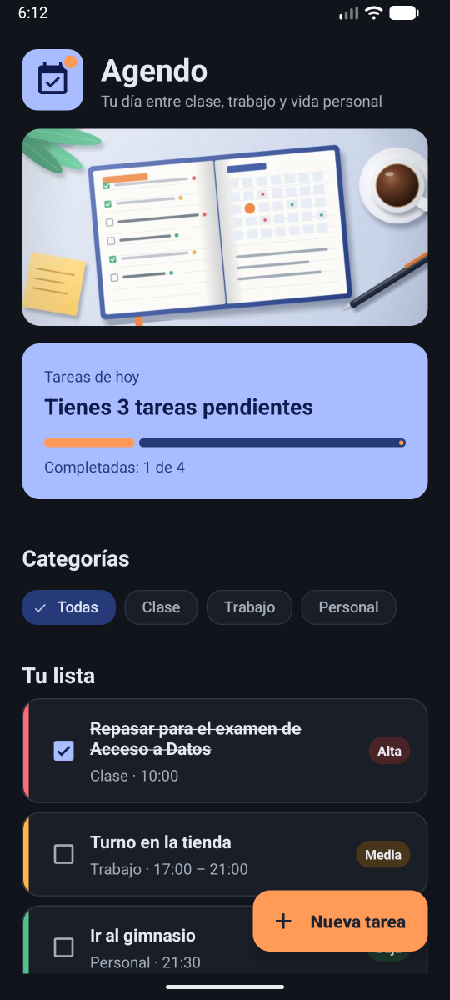
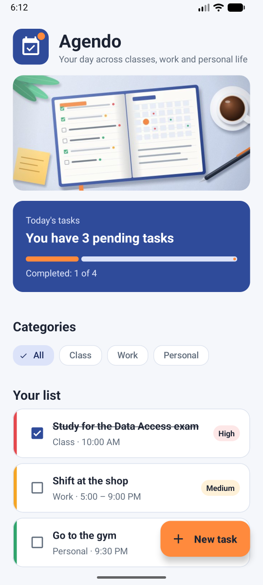
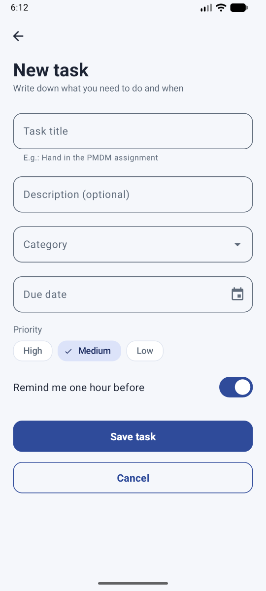
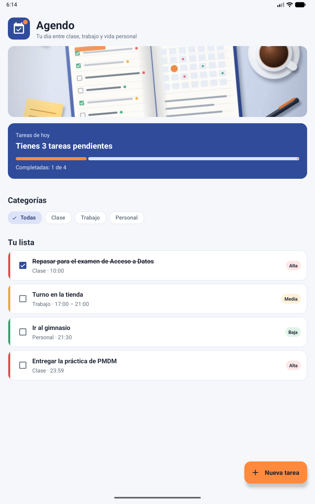
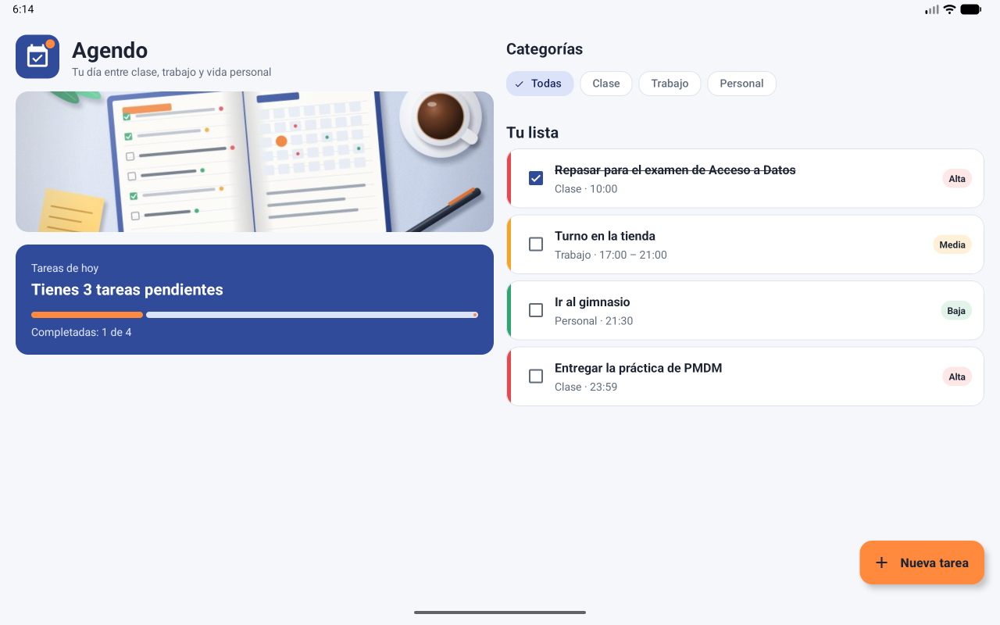
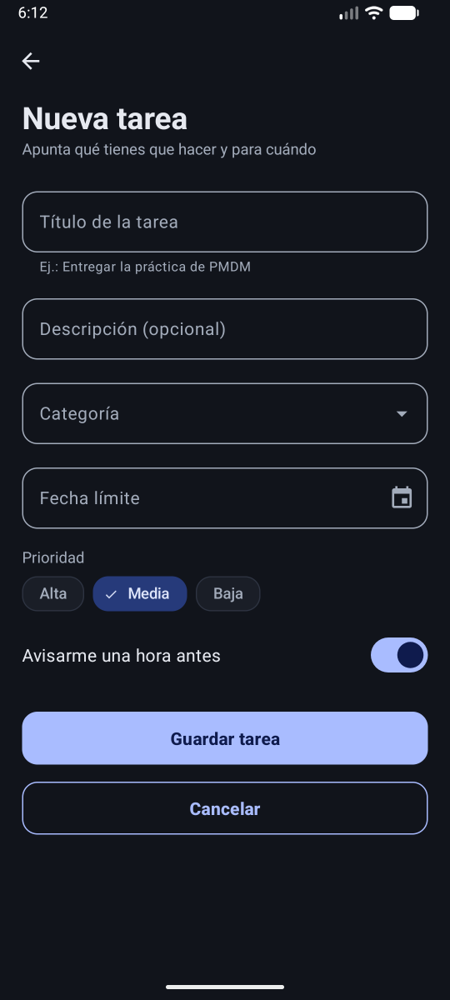
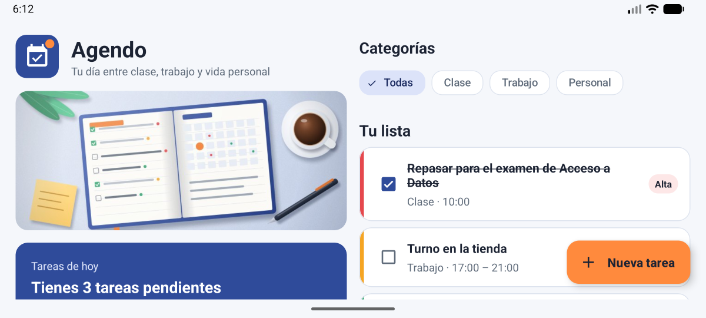
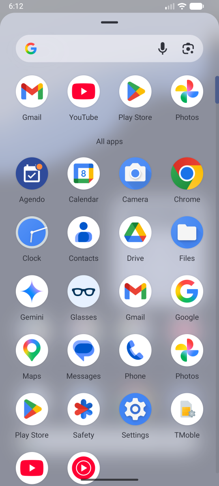

# Agendo · Planificador de tareas

**Práctica 1 de Programación Multimedia y Dispositivos Móviles (PMDM)** · Daniel Radulescu

Agendo es un planificador de tareas sencillo pensado para estudiantes de FP que compaginan las clases con un trabajo y su vida personal. Muestra de un vistazo las tareas del día, cuántas quedan pendientes y su prioridad con un código de colores (alta, media y baja), y permite filtrarlas por categoría: **Clase**, **Trabajo** o **Personal**.

El objetivo de la práctica es el diseño de la interfaz y la gestión de recursos (textos, imágenes, colores, estilos e icono), no la persistencia de datos.

<p align="center">
  
  
  
</p>

## Funcionalidades

- **Resumen del día**: número de tareas pendientes y barra de progreso, que se actualizan al marcar o desmarcar una tarea.
- **Lista de tareas** con franja y etiqueta de color según la prioridad. Las tareas completadas se tachan.
- **Filtro por categoría** con chips (Todas, Clase, Trabajo, Personal).
- **Pantalla "Nueva tarea"**: título, descripción, categoría, fecha límite, prioridad y recordatorio. Avisa si falta el título y confirma el guardado con un mensaje.
- **Dos idiomas**: español (por defecto) e inglés.
- **Tema claro y tema oscuro**, según el ajuste del sistema.
- **Diseño adaptado** al móvil y a la tablet, en vertical y en horizontal (dos columnas).

## Capturas

### Español e inglés (móvil)

| Español | Inglés |
|:---:|:---:|
|  |  |
|  |  |

### Tablet

| Vertical | Horizontal (dos columnas) |
|:---:|:---:|
|  |  |

### Tema oscuro, horizontal e icono

| Tema oscuro | Móvil en horizontal | Icono en el lanzador |
|:---:|:---:|:---:|
|  |  |  |

## Cómo ejecutarla

### Requisitos

- **Android Studio** en una versión reciente. Ya incluye el JDK necesario.
- **Android SDK Platform 37**. Si no está instalado, Android Studio lo ofrece al sincronizar el proyecto.
- Un dispositivo virtual (AVD) o un móvil físico con **Android 7.0 (API 24) o superior**.

### Pasos

1. Clona el repositorio:
   ```bash
   git clone https://github.com/lordo0174/PMDM_P1_DanielRadulescu.git
   ```
2. En Android Studio, elige **File › Open** y selecciona la carpeta `PMDM_P1_DanielRadulescu`.
3. Espera a que termine la sincronización de Gradle.
4. Elige un dispositivo en la barra superior y pulsa **Run ▶** (o `Mayús + F10`).

También se puede compilar desde la terminal con `./gradlew assembleDebug` (en Windows, `gradlew.bat assembleDebug`). El APK queda en `app/build/outputs/apk/debug/`.

### Probar el idioma y el tema oscuro

- **Idioma**: en el emulador, ve a *Ajustes › Sistema › Idiomas* y pon **English** o **Español**. La app se traduce sola.
- **Tema oscuro**: activa *Ajustes › Pantalla › Tema oscuro*.

## Dispositivos de prueba

| AVD | Tipo | Resolución | Densidad | API |
|---|---|---|---|---|
| Medium Phone | Móvil | 1080 × 2400 px | 420 dpi (xxhdpi) | 37 |
| Medium Tablet | Tablet | 2560 × 1600 px | 320 dpi (xhdpi) | 37 |

## Estructura del proyecto

```
app/src/main/
├── AndroidManifest.xml          Activities, icono, tema y nombre de la app
├── java/es/medac/danielradulescu/app/
│   ├── MainActivity.java        Pantalla principal (resumen, filtro y lista)
│   └── NuevaTareaActivity.java  Formulario "Nueva tarea"
└── res/
    ├── layout/                  Diseños en vertical (activity_main, activity_nueva_tarea y secciones)
    ├── layout-land/             Pantalla principal en horizontal (dos columnas)
    ├── values/                  strings, colors, dimens, styles y themes
    ├── values-en/               Textos en inglés
    ├── values-night/            Colores del tema oscuro
    ├── drawable/                Iconos vectoriales, logotipo e imagen de cabecera (JPG)
    ├── color/                   Selector de color para los bordes de los campos
    └── mipmap-*/                Icono adaptativo y sus versiones por densidad
```

## Documentación

La memoria de la práctica (análisis, especificación, entorno y recursos) está en [`docs/memoria.pdf`](docs/memoria.pdf).

## Autor

**Daniel Radulescu** · Desarrollo de Aplicaciones Multiplataforma · MEDAC
